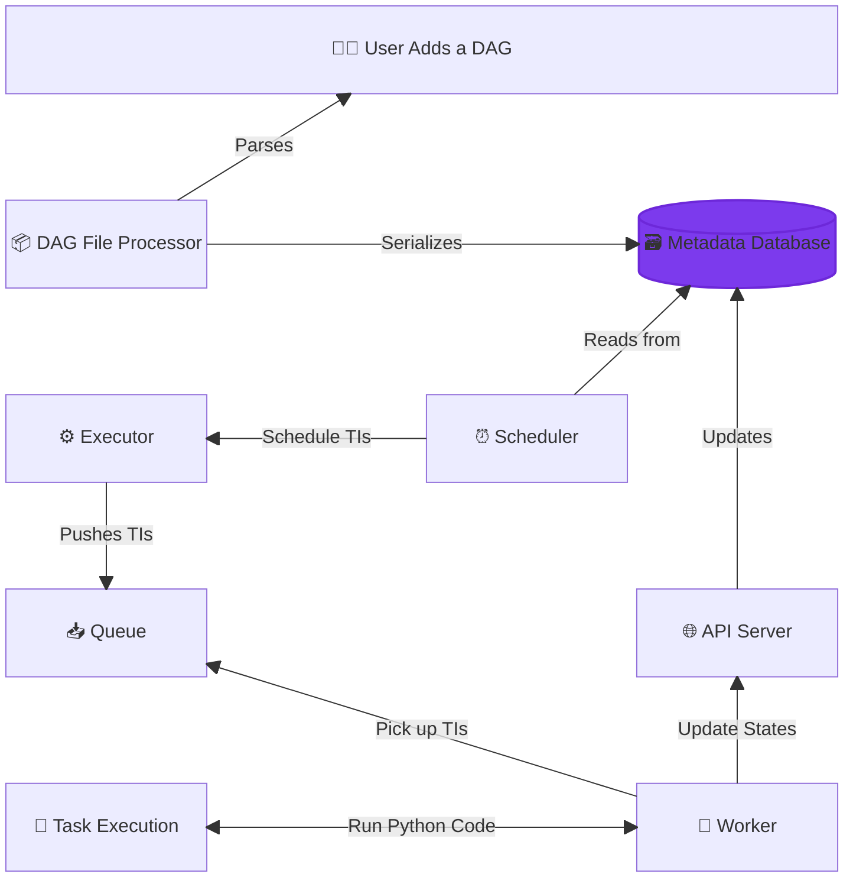
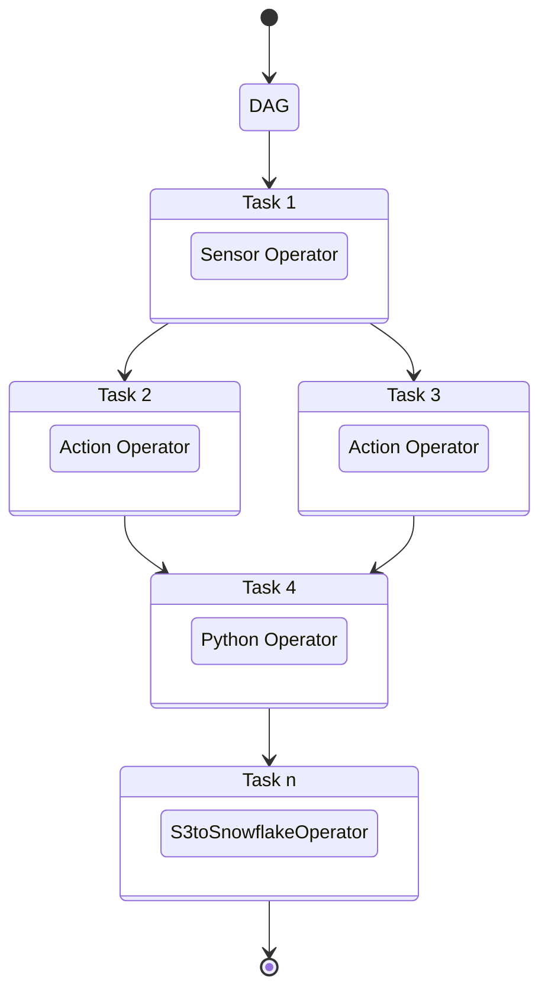

# Apache Airflow
## Table of Contents

- [Overview](#overview)
- [Key Terms](#key-terms)
- [DAG Execution Lifecycle](#dag-execution-lifecycle)
- [Task Dependencies](#task-dependencies)
- [Sensor](#sensor)


## Overview

Apache Airflow is an open-source platform for developing, scheduling, and monitoring batch-oriented workflows. Airflow’s extensible Python framework enables you to build workflows connecting with virtually any technology. A web-based UI helps you visualize, manage, and debug your workflows. You can run Airflow in a variety of configurations — from a single process on your laptop to a distributed system capable of handling massive workloads.

## Key Terms

- **DAG:**: A directed acyclical graph that represents a single data pipeline
- **Task:** An individual unit of work in a DAG
- **Operator:** The specific work that a Task performs
  There are three main types of operators:
  - **Action:** Perform a specific action such as running code or a bash command (e.g. PostgresOperator)
  - **Transfer:** Perform transfer operations that move data between two systems (e.g. S3toSnowflakeOperator)
  - **Sensor:** Wait for a specific condition to be met (e.g., waiting for a file to be present) before running the next task (e.g. FileSensor)

## DAG Execution Lifecycle 

<details>
  <summary><b>How Does Airflow Run a DAG?</b></summary>

  - The DAG File Processor constantly scans the DAGs directory for new files. The default time is every 5 minutes.
  - After the DAG File Processor detects a new DAG, the DAG is processed and serialized into the metadata database.
  - The scheduler checks for DAGs that are ready to run in the metadata database. The default time is every 5 seconds.
  - Once a DAG is ready to run, its tasks are put into the executor's queue.
  - Once a worker is available, it will retrieve a task to execute from the queue.
  - The worker will then execute the task.

</details>


## Task Dependencies
<details>
  <summary><b>Task Dependencies</b></summary>

  ```python
  # Imports
  from airflow.sdk import dag, task
  from airflow.providers.standard.operators.python import PythonOperator
  from airflow.providers.standard.operators.bash import BashOperator

  # DAG Object
  @dag(schedule=None, description="A DAG that runs manually")
  def my_dag():

    # Tasks (Operators)
    task_1 = PythonOperator(task_id="a",...)
    task_b = BashOperator(task_id="b", ...)

  # Task Dependencies
  task_a >> task_b
```

**Diagram:**

</details>

## Sensor

A Sensor is a particular operator that waits for a condition to be true. If the condition is true, the task is marked successful , and the next task runs. If the condition is false, the sensor waits for another interval until it times out and fails.

- Sensor wait for an event/condition to be met to complete.
- A sensor times out after `timeout` seconds (7 days by default)
- A sensor checks an event/condition at every `poke_interval` (60 seconds by default)
- While a sensor waits, it continuously takes a work slot
- If you have many sensors or expect them to take time before complete, use the `reschedule` mode
- With the reschedule mode, while a sensor is waiting, its status will be `up_for_reschedule`
- Create a sensor with `@task.sensor`

<details>
  <summary>Why Sensors? </summary>
  The purpose of a Sensor is to wait for an event.

  That can be useful for many different use cases, such as:

- Processing files from an S3 bucket as they arrive while waiting for them.
- Running different tasks at different times but within the same DAG.
- Triggering a data pipeline when another one completes.
- Ensuring an API is available to make requests.
- Transforming data as soon as data are present in a SQL table.

</details>

<details>
  <summary>Best Practices</summary>

When using sensors, keep the following in mind to avoid potential performance issues:

- Always define a meaningful timeout parameter for your sensor. The default for this parameter is seven days, which is a long time for your sensor to be running. When you implement a sensor, consider your use case and how long you expect the sensor to wait and then define the sensor's timeout accurately.
- Whenever possible and especially for long-running sensors, use the reschedule mode so your sensor is not constantly occupying a worker slot. This helps avoid deadlocks in Airflow where sensors take all of the available worker slots.
- If your poke_interval is very short (less than about 5 minutes), use the poke mode. Using reschedule mode in this case can overload your scheduler.
- Define a meaningful poke_interval based on your use case. There is no need for a task to check a condition every 60 seconds (the default) if you know the total amount of wait time will be 30 minutes.

</details>
