# Apache Airflow

## What is Airflow?

Apache Airflow is an open-source platform for developing, scheduling, and monitoring batch-oriented workflows. Airflow’s extensible Python framework enables you to build workflows connecting with virtually any technology. A web-based UI helps you visualize, manage, and debug your workflows. You can run Airflow in a variety of configurations — from a single process on your laptop to a distributed system capable of handling massive workloads.

## Key Terms:
- **DAG:**: A directed acyclical graph that represents a single data pipeline
- **Task:** An individual unit of work in a DAG
- **Operator:** The specific work that a Task performs
  There are three main types of operators:
    - **Action:** Perform a specific action such as running code or a bash command
    - **Transfer:** Perform transfer operations that move data between two systems
    - **Sensor:** Wait for a specific condition to be met (e.g., waiting for a file to be present) before running the next task

## Core Components:
  - **API Server:** FastAPI server serving the UI and handling task execution requests
  - **Scheduler:** Schedule tasks when dependencies are fulfilled
  - **DAG File Processor:** Dedicated process for parsing DAGs
  - **Metadata Database:** A database where all metadata are stored
  - **Executor:** Defines how tasks are executed
  - **Queue:** Defines the execution task order
  - **Worker:** Process executing the tasks, defined by the executor
  - **Triggerer:** Process running asyncio to support deferrable operators

## How Does Airflow Run a DAG?

```mermaid
flowchart TB

%% === User Actions ===
subgraph UA ["👤 User Actions"]
  direction LR
  A1["📝 DAG File (Python)"] --> A2["📦 Placed in DAGs Folder"] --> A3["🔁 Parsed by Scheduler"]
end

%% === Scheduler  ===
subgraph SCH ["⏱️ Airflow Scheduler"]
  direction LR
  B1["🧠 Scheduler Parses DAGs"] --> B2["📅 Checks Schedule"] --> B3["⏰ Triggers DAG Run"] --> B4["📥 Creates DAG Run"] --> B5["📤 Tasks Sent to Executor"]
end

%% === Executor ===
subgraph EXE ["⚙️ Executor Queue"]
  direction LR
  C1["🔧 Celery/K8s/Local Executor"] --> C2["📨 Tasks Dispatched"]
end

%% === Worker ===
subgraph WRK ["🧪 Worker Node"]
  direction LR
  D1["⚙️ Worker Executes"] --> D2["🗂️ Logs Stored"] --> D3["📬 Status Reported"]
end

%% === DB/UI  ===
subgraph DBUI ["🗃️ Metadata Database"]
  E1["📊 UI Shows Status"]
end

%% === Block Connections ===
UA --> SCH --> EXE --> WRK --> DBUI
```

## Task

A single unit of work in a DAG.

## Operator
- Action Operators (e.g. PostgresOperator)
- Transfer Operators (e.g. S3toSnowflakeOperator)
- Sensor Operators (e.g. FileSensor)

## Sensor

A Sensor is a particular operator that waits for a condition to be true. If the condition is true, the task is marked successful , and the next task runs. If the condition is false, the sensor waits for another interval until it times out and fails.

- Sensor wait for an event/condition to be met to complete.
- A sensor times out after `timeout` seconds (7 days by default)
- A sensor checks an event/condition at every `poke_interval` (60 seconds by default)
- While a sensor waits, it continuously takes a work slot
- If you have many sensors or expect them to take time before complete, use the `reschedule` mode
- With the reschedule mode, while a sensor is waiting, its status will be `up_for_reschedule`
- Create a sensor with `@task.sensor`

  
Why Sensors? 

  The purpose of a Sensor is to wait for an event.

  That can be useful for many different use cases, such as:

- Processing files from an S3 bucket as they arrive while waiting for them.
- Running different tasks at different times but within the same DAG.
- Triggering a data pipeline when another one completes.
- Ensuring an API is available to make requests.
- Transforming data as soon as data are present in a SQL table.

  
Best Practices

When using sensors, keep the following in mind to avoid potential performance issues:

- Always define a meaningful timeout parameter for your sensor. The default for this parameter is seven days, which is a long time for your sensor to be running. When you implement a sensor, consider your use case and how long you expect the sensor to wait and then define the sensor's timeout accurately.
- Whenever possible and especially for long-running sensors, use the reschedule mode so your sensor is not constantly occupying a worker slot. This helps avoid deadlocks in Airflow where sensors take all of the available worker slots.
- If your poke_interval is very short (less than about 5 minutes), use the poke mode. Using reschedule mode in this case can overload your scheduler.
- Define a meaningful poke_interval based on your use case. There is no need for a task to check a condition every 60 seconds (the default) if you know the total amount of wait time will be 30 minutes.

  style A1 fill:#fdf6e3,stroke:#657b83,stroke-width:1px
  style D1 fill:#fce5cd,stroke:#cc0000,stroke-width:1px
  style B5 fill:#d9ead3,stroke:#38761d,stroke-width:1px
